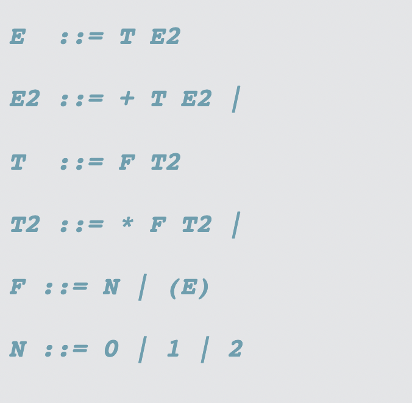

## Parser
### 最终目标是实现课件上的自顶向下句法分析算法
- 但是这个算法比较难，要回溯
- 而且只能判断句法对不对，没法保存句法结构，生成句法树
### 先复习一下大三上的项目，ArithMeticParser
- 实现的是支持 0 1 2 + - ( ) 运算的 parser
- 基本结构(源代码是 go, Java 复现)
  - 类型定义: enum, 包括表达式类型 Type, 元素值 Value
  - Exp interface:
    - pretty()
    - infer(): 表达式类型
    - visualize(): 语法树可视化相关
    - getNode(): 语法树可视化相关
  - 其他表达式类型，实现 Exp interface，都是 class
    - Num: value
    - Mult: Exp[2]
    - Plus: Exp[2]
    - Parenthesis: Exp e
  - State, Result 两个结构的定义
  - scan(): 读取字符串里的下一个字符，得到解析结果(Value 类型)
  - parse():
    - 改写了规则，避免左递归和 ambiguity
    - 对于每一个成分，有且只有一个确定的规则
    - 
  - 额外增加的：StackOverflow 上看到的TreeNode 类，配合实现AST的可视化

### 接下来实现 TopDownParser
- 只实现了如下规则
  - S -> NP VP
  - NP -> ART N
  - VP -> V NP
- 基本是在 ArithMeticParser 基础上做简单修改得到的
- 局限性: 一个成分，只支持一条转换规则，无法在多条规则中进行选择

### AdvancedTopDownParser
- 回顾上面两个 Parser, 有如下缺陷
  - 通过重写规则，避免模糊性，重写规则工作量很大
  - 每个复合类型对应一个 parse 方法
    - NP -> parseNP
    - VP -> parseVP
- 这些缺陷是可以改进的
  - 我们的语法规则，左右是没有相同元素的，不需要避免模糊性，不用重写规则
  - 不同复合类型的 parse, 其原理一致，完全可以抽成一个公共函数
- 实际改进
  - 定义了两种成分， Atom 和 Compound
    - Atom: 原子类型，不能进一步分解，type 指示具体是 N, ART 还是 V
    - Compound： 复合类型，存在子节点
  - 用 Map 存放规则
  - genericParse(..., startType)
    - startType 是原子元素：读取token， 返回Atom
    - 是复合元素：按照转换规则，分成多个 Type 进行 parse, 组合 parse 的结果（数组），构成复合类型
- 总结：不需要给每个复合类型写一个 parse 方法了，方便多了